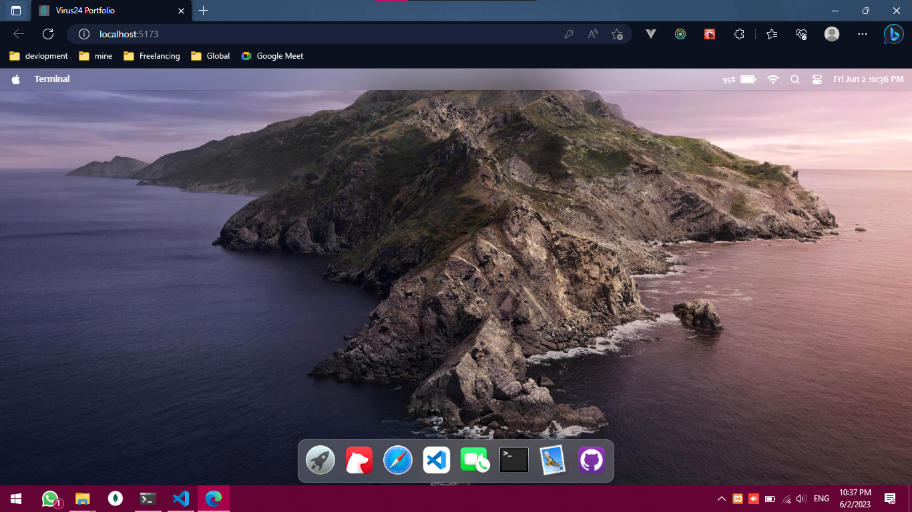
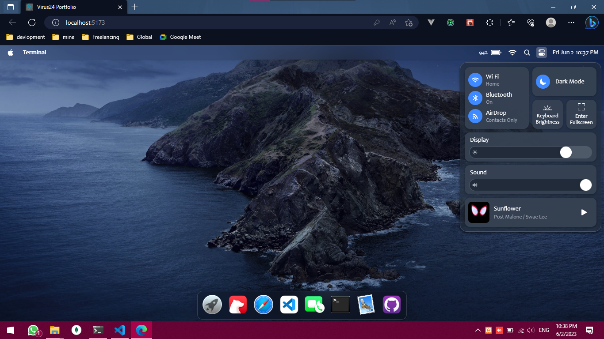

# intro

 website simulating macOS's GUI: 

Powered by [React](https://reactjs.org/) + [React Redux](https://react-redux.js.org/) + [UnoCSS](https://uno.antfu.me/) + [TypeScript](https://www.typescriptlang.org/) + [Vite](https://vitejs.dev/).





&nbsp;

## Usage

Clone the repo and install dependencies:

```bash
yarn install
```

Start dev server (with hot reloading):

```bash
yarn dev
```

Build for production with minification to the `dist` folder:

```bash
yarn build
```

&nbsp;

## License

[MIT](MIT)
